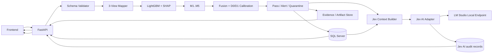

# 05 — SYSTEM ARCHITECTURE — V3

## Architectural style

Modular Python monorepo with four hard boundaries:

1. **Detection Core** — deterministic scientific pipeline: validation, view mapping, LightGBM/SHAP, M1–M5, fusion/calibration and decision.
2. **Platform / Persistence** — FastAPI, Microsoft SQL Server, audit/evidence, auth/RBAC, artifacts, observability.
3. **Jev AI Collaboration Layer** — local LM Studio adapter that consumes approved canonical evidence and produces advisory explanations/triage/report text.
4. **Frontend** — operator UI; never reimplements detector formulas.

## Runtime architecture

## Authority boundary

`Detection Core result > Jev AI narrative`.

Jev AI cannot mutate detector config, model files, scores, thresholds, decision labels, experiment evidence or blind manifests. Jev output is an annotation tied to a canonical analysis result.

## Canonical input modes

### Phase 1 — vector-first

- Exactly 2,381 finite numeric EMBER features.
- Versioned schema and view mapping.
- Preferred path for research reproducibility and MVP.

### Phase 2 — raw PE

- Static parsing only.
- Never executes malware.
- Disabled until extractor/schema equivalence tests pass.

## Persistence

Microsoft SQL Server is the canonical operational database. Large binaries/evidence remain outside SQL Server and are referenced by URI + checksum. Blind ground truth and hidden attack manifests remain in isolated evaluation custody.

## Jev AI runtime

- Local OpenAI-compatible LM Studio endpoint.
- Disabled by default.
- Not a readiness blocker for Detection Core.
- Fails closed to `AI_UNAVAILABLE` without affecting canonical detector result.
- Receives a minimized structured context, not raw PE bytes by default.

## Frontend split

The frontend has two visually separate evidence classes:

- **Canonical detector evidence** — scores, M1–M5, SHAP, view contributions, threshold, decision, model/config hashes.
- **Jev AI advisory narrative** — explanation, triage suggestions, uncertainty and source/evidence references.

The UI must never style Jev AI prose as if it were the detector's scientific decision.
