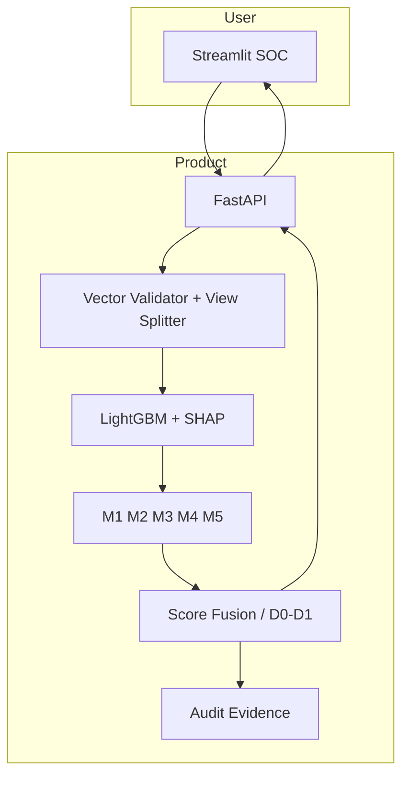

# Architecture diagrams

```mermaid
flowchart TB
  subgraph User
    UI[Streamlit SOC]
  end
  subgraph Product
    API[FastAPI]
    DATA[Vector Validator + View Splitter]
    MODEL[LightGBM + SHAP]
    DET[M1 M2 M3 M4 M5]
    FUS[Score Fusion / D0-D1]
    AUD[Audit Evidence]
  end
  UI --> API --> DATA --> MODEL --> DET --> FUS --> AUD
  FUS --> API --> UI
```
